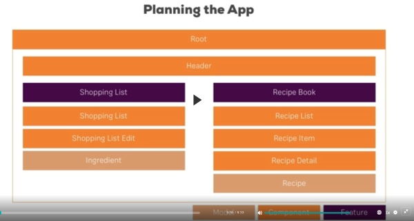

# Recipe

This project was generated with [Angular CLI](https://github.com/angular/angular-cli) version 11.2.6.

## Kanban Tasks: Project Refs

1. Video Ref. <https://learning.oreilly.com/videos/angular-the-complete>

### Task: ngModel on template form

1. Check values on templated-form using ngModel
2. Check: each control has ngModel and name atributes
3. Check: formsModule add to app.module
4. Check: ```<form (ngSubmit)="onSubmit(f)" #f="ngForm" >```
5. Fill out form and look for user values


```TypeScript
onSubmit(form: NgForm) {
    console.log(form);
  }
```

Task: Add validation 'rquired'

1. Angular adds class to check ... ng-dirty ng-valid...
2. Disable button if form not valid

```TypeScript
<button
        class="btn btn-primary"
        type="submit"
        [disabled]="!f.valid"
        >Submit</button>
```

### Task: Radio Buttons

1. ```<input type="radio">```

### Task: @ViewChild()

1. ```@ViewChild('f') signupForm" NgForm;```
2. Gives access to a template component

3. This is a method to change all the form values
4. Video Ref <https://learning.oreilly.com/videos/angular-the-complete/9781788998437/9781788998437-video15_17/>


## Task: patchValue()

1. This is a method to change one specific
2. Uses a JavaScript literal 'user' user = {name: '', gender: ''...}


## Task: output form summary on submit


## Task: Reset the form

1. ```this.myform.reset( <optional default values>);```
2. TODO: Asignment onsolution at end of Ch15

### Task: Rective Forms: TODO: Asignment onsolution at end of Ch15

### TODO: Ch16 Course Project - Forms

1. something

### TODO: Chp19 Couse Project - Http

### TODO: 'Angular Universal' pre rending on the server

## Chapter 3 : Course Project - The Basics

### Task: Setting up the Application

1. Add Bootstrap ```npm i bootstrap --save```
2. Update file: angular.json for bundle generation
3. plugin Emit

```javascript
path is relative to root of project
            "styles": [
              "node_modules/bootstrap/dist/css/bootstrap.min.css",
              "src/styles.css"
            ],
            "scripts": []
          },
```

### Task: Create components



### Task: Using components

### Task: Adding a Navigation Bar

### Task: Creating a "Recipe" Model

### Task: Adding Content to the Recipes' Components

### Task: Displaying Recipe Details

1. NOTE for Emmet in VSCode <https://code.visualstudio.com/docs/editor/emmet>
2. NOTES <https://docs.emmet.io/actions/expand-abbreviation/>

### Task: Working on the ShoppingList Component

### Task: ShoppingEdit Component

### Task: Binding to Custom Properties

1. ref <https://learning.oreilly.com/videos/angular-the-complete/9781788998437/9781788998437-video5_4/>

### Task: Binding to Custom Events

1. ref <https://learning.oreilly.com/videos/angular-the-complete/9781788998437/9781788998437-video5_6/>

2. See Project:github/kata-output

3. We can define:```Encapsulation: Emulated(default) | native | None```

4. Local ref: #everNameIput (template ref to be use any where in the template, but only there )

### Task: Getting Access to the Template and Document Object Model (DOM) with the @ViewChild Component

1. ref <https://learning.oreilly.com/videos/angular-the/9781788998437/9781788998437-video5_12/>

2. ```@ViewChild('varNameLocal', {static: true}, varName): ElementRef```  #varNameLocal is the DOM elemen local var
3. NB we could aslo use ```@ViewChild(ChildComponent, {static: true}, childComponent)``` to ref a child component
4. ```this.varName.nativeElement.value``` to get the underlying element props

### Task: Projecting Content into Components with ng-content

1. Ref:<https://learning.oreilly.com/videos/angular-the/9781788998437/9781788998437-video5_13/>
2. ```<ng-content><ng-content>```
3. ```<app-component> <h1>Geoff</h1></app-component>```

### Task: Understanding the Component Lifecycle

1. Ref:<https://learning.oreilly.com/videos/angular-the/9781788998437/9781788998437-video5_14/>

### Notes on Angular event hooks

1. ngOnChanges - after a bound input property changes @Input() - called multipal times
2. ngOnInit - once the component is initialized, not that you can see it, runs after the constructor - called once
3. ngDoCheck - every time change detection runs - each change in the template, and even of checks that don't result in a template update (button click etc) - call multipal times
4. ngAfterContentInit - after content (ng-content) has been projected into view (parent template)
5. ngAfterViewInit -after component and child views have been initialized
6. ngOnDestroy - once the component is about to be destroyed (place for cleanup work)
